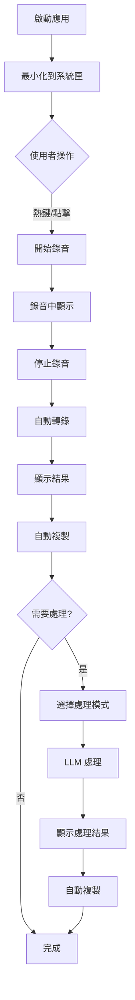

# 產品需求文檔 (PRD)
# 語音轉文字助手

**文檔版本**: 1.0  
**最後更新**: 2024-01-15  
**產品負責人**: [待填寫]  
**技術負責人**: [待填寫]  
**狀態**: 草案

---

## 1. 執行摘要

### 1.1 產品願景
開發一款 Windows 平台的桌面應用程式，透過整合 OpenAI Whisper 語音識別技術和本地 LLM（Ollama），為使用者提供高效、隱私、智慧的語音轉文字解決方案。

### 1.2 目標用戶
- **主要用戶**: 軟體開發人員、技術文檔撰寫者
- **次要用戶**: 內容創作者、學生、研究人員
- **特徵描述**: 需要頻繁將語音轉換為文字，重視隱私保護，有一定技術背景

### 1.3 核心價值主張
- **快速轉錄**: GPU 加速，5-10倍實時轉錄速度
- **隱私保護**: 所有處理本地完成，無需上傳雲端
- **智慧整理**: AI 自動修正錯誤、整理格式
- **無縫整合**: 系統匣常駐，一鍵使用，自動複製

---

## 2. 產品背景與市場分析

### 2.1 問題陳述
現有語音轉文字解決方案存在以下問題：
1. **隱私風險**: 大多數服務需要上傳音訊到雲端
2. **使用不便**: 需要開啟網頁或特定應用程式
3. **成本問題**: 優質服務需要付費訂閱
4. **整合困難**: 難以與日常工作流程整合

### 2.2 市場機會
- Windows 平台缺乏優秀的本地語音轉文字工具
- 隱私意識提升，本地處理需求增長
- AI 技術成熟，使本地高品質轉錄成為可能

### 2.3 競品分析

| 產品 | 優勢 | 劣勢 | 定價 |
|------|------|------|------|
| Dragon NaturallySpeaking | 準確度高、功能完整 | 價格昂貴、資源佔用大 | $150-500 |
| Windows 語音輸入 | 免費、系統內建 | 準確度一般、功能簡單 | 免費 |
| Otter.ai | 即時轉錄、協作功能 | 需要網路、隱私疑慮 | $8.33/月起 |
| Google Docs 語音輸入 | 免費、準確度佳 | 需要網路、僅限瀏覽器 | 免費 |

### 2.4 差異化策略
- **本地處理 + GPU 加速**: 兼顧隱私和效能
- **LLM 整合**: 獨特的智慧文字處理功能
- **開發者友好**: 專為技術人員優化的功能

---

## 3. 產品目標與成功指標

### 3.1 產品目標
1. **短期目標 (3個月)**
   - 完成 MVP 版本開發
   - 實現基本語音轉文字功能
   - 達成 95% 以上準確率

2. **中期目標 (6個月)**
   - 整合 LLM 文字處理功能
   - 支援批次處理
   - 優化資源使用

3. **長期目標 (12個月)**
   - 跨平台支援 (macOS, Linux)
   - 多語言界面
   - 插件系統

### 3.2 成功指標 (KPIs)

| 指標 | 目標值 | 測量方法 |
|------|--------|----------|
| 轉錄準確率 | > 95% | WER (Word Error Rate) |
| 轉錄速度 | > 5x 實時 | RTF (Real-Time Factor) |
| 啟動時間 | < 3 秒 | 冷啟動計時 |
| 記憶體使用 | < 2GB | 任務管理器監控 |
| 用戶滿意度 | > 4.5/5 | 用戶調查 |

---

## 4. 功能需求

### 4.1 功能架構圖
```
語音轉文字助手
├── 核心功能
│   ├── 語音錄製
│   ├── 語音轉文字
│   ├── 文字處理
│   └── 剪貼簿管理
├── 使用者介面
│   ├── 系統匣
│   ├── 主視窗
│   └── 設定頁面
└── 系統功能
    ├── GPU 加速
    ├── 模型管理
    └── 熱鍵支援
```

### 4.2 詳細功能規格

#### 4.2.1 語音錄製功能

**功能描述**: 提供便捷的語音錄製能力

**功能細節**:
- 支援系統預設麥克風
- 即時音量顯示
- 自動降噪處理
- 最長錄製時間: 10分鐘

**使用場景**:
1. 使用者按下熱鍵開始錄音
2. 說話時看到音量波形反饋
3. 再次按下熱鍵停止錄音

**接受標準**:
- [ ] 錄音啟動延遲 < 100ms
- [ ] 音質清晰無雜音
- [ ] 支援 16kHz 取樣率

#### 4.2.2 語音轉文字功能

**功能描述**: 使用 Whisper 模型進行高準確度語音識別

**功能細節**:
- 支援多種 Whisper 模型 (tiny/base/small/medium/large)
- 自動語言偵測
- GPU 加速支援
- 離線運作

**模型選擇邏輯**:
```
if GPU_Memory >= 6GB:
    use "small" model
elif GPU_Memory >= 4GB:
    use "base" model
else:
    use "tiny" model
```

**接受標準**:
- [ ] 中文準確率 > 95%
- [ ] 英文準確率 > 97%
- [ ] GPU 加速提升 5x 以上

#### 4.2.3 智慧文字處理

**功能描述**: 整合 Ollama LLM 進行文字後處理

**處理模式**:
1. **錯字修正**: 修正拼寫和語法錯誤
2. **標點優化**: 添加適當的標點符號
3. **格式整理**: 分段、縮排等
4. **摘要生成**: 提取關鍵要點

**使用流程**:
```
原始轉錄文字 → 選擇處理模式 → LLM 處理 → 輸出整理後文字
```

**接受標準**:
- [ ] 處理時間 < 3秒
- [ ] 保持原意不變
- [ ] 支援自定義模板

#### 4.2.4 系統整合功能

**功能描述**: 與 Windows 系統深度整合

**功能細節**:
- 系統匣圖示與選單
- 全域熱鍵支援
- 自動開機啟動
- Windows 通知整合

**熱鍵配置**:
| 功能 | 預設熱鍵 | 可自訂 |
|------|----------|--------|
| 開始/停止錄音 | Ctrl+Alt+R | ✓ |
| 顯示主視窗 | Ctrl+Alt+H | ✓ |
| 複製最後結果 | Ctrl+Alt+C | ✓ |

---

## 5. 使用者體驗設計

### 5.1 使用者流程圖



### 5.2 介面設計原則

1. **極簡主義**: 減少視覺雜訊，專注核心功能
2. **即時反饋**: 每個操作都有明確的視覺/聽覺反饋
3. **智慧預設**: 預設值滿足 80% 使用場景
4. **無障礙設計**: 支援鍵盤導航和螢幕閱讀器

### 5.3 主要畫面設計

#### 5.3.1 系統匣圖示狀態
- **待機**: 灰色麥克風圖示
- **錄音中**: 紅色圓點 + 脈動動畫
- **處理中**: 旋轉的處理圖示
- **完成**: 綠色勾號（暫時顯示）

#### 5.3.2 主視窗設計
```
┌─────────────────────────────────┐
│     🎤 語音轉文字助手            │ [最小化][關閉]
├─────────────────────────────────┤
│                                 │
│      [🎤 開始錄音]              │
│                                 │
│  ┌─────────────────────────┐   │
│  │                         │   │
│  │    轉錄結果顯示區域      │   │
│  │                         │   │
│  └─────────────────────────┘   │
│                                 │
│  [📋 複製] [✨ 整理] [⚙️ 設定]  │
└─────────────────────────────────┘
```

---

## 6. 技術需求

### 6.1 技術架構
- **開發語言**: Python 3.10+
- **GUI 框架**: PyQt5
- **語音識別**: OpenAI Whisper
- **LLM 引擎**: Ollama
- **打包工具**: PyInstaller

### 6.2 效能需求
| 項目 | 需求 | 優先級 |
|------|------|--------|
| 啟動時間 | < 3 秒 | P0 |
| 記憶體使用 | < 2GB (含模型) | P0 |
| CPU 使用率 | < 10% (待機) | P1 |
| 轉錄延遲 | < 2 秒 | P0 |
| 模型載入 | < 5 秒 | P1 |

### 6.3 相容性需求
- **作業系統**: Windows 10/11 (64-bit)
- **最低硬體**: 
  - CPU: Intel i5 / AMD Ryzen 5
  - RAM: 8GB
  - 儲存: 5GB
- **建議硬體**:
  - GPU: NVIDIA GTX 1060+
  - RAM: 16GB
  - 儲存: 10GB (SSD)

### 6.4 安全性需求
- 所有音訊處理必須本地完成
- 不收集任何使用者資料
- 設定檔加密儲存
- 音訊檔案使用後立即刪除

---

## 7. 專案規劃

### 7.1 開發階段

#### Phase 1: MVP (4週)
- [x] 專案架構設計
- [ ] 基礎 UI 實現
- [ ] 音訊錄製功能
- [ ] Whisper 整合
- [ ] 系統匣功能

#### Phase 2: 核心功能 (3週)
- [ ] GPU 加速優化
- [ ] 剪貼簿自動複製
- [ ] 熱鍵支援
- [ ] 基礎設定功能

#### Phase 3: 智慧功能 (3週)
- [ ] Ollama 整合
- [ ] 文字處理模板
- [ ] 批次處理
- [ ] 進階設定

#### Phase 4: 優化與發布 (2週)
- [ ] 效能優化
- [ ] 打包與安裝程式
- [ ] 使用者文檔
- [ ] 測試與除錯

### 7.2 資源需求
- **開發人員**: 1-2 名
- **設計人員**: 0.5 名（兼職）
- **測試人員**: 0.5 名（兼職）
- **預計工時**: 12 週

### 7.3 風險評估

| 風險 | 影響 | 機率 | 緩解措施 |
|------|------|------|----------|
| GPU 相容性問題 | 高 | 中 | 提供 CPU 降級方案 |
| 模型下載失敗 | 中 | 低 | 離線安裝包 |
| Ollama 整合困難 | 中 | 中 | 準備備選 LLM 方案 |
| 打包體積過大 | 低 | 高 | 模組化安裝 |

---

## 8. 驗收標準

### 8.1 功能驗收
- [ ] 完成所有 P0 功能
- [ ] 通過所有功能測試
- [ ] 無 P0/P1 等級 bug

### 8.2 效能驗收
- [ ] 符合所有效能需求指標
- [ ] GPU 加速正常運作
- [ ] 記憶體無洩漏

### 8.3 使用者驗收
- [ ] 完成使用者測試
- [ ] 滿意度評分 > 4/5
- [ ] 關鍵問題修復

---

## 9. 未來展望

### 9.1 版本規劃
- **v1.1**: macOS 支援
- **v1.2**: 雲端同步選項
- **v1.3**: 插件系統
- **v2.0**: 即時翻譯功能

### 9.2 潛在擴展
- 視訊會議整合
- API 服務化
- 移動端支援
- 多人協作功能

---

## 10. 附錄

### 10.1 術語表
- **Whisper**: OpenAI 開發的語音識別模型
- **Ollama**: 本地運行的 LLM 框架
- **RTF**: Real-Time Factor，轉錄速度指標
- **WER**: Word Error Rate，準確率指標

### 10.2 參考資料
- [OpenAI Whisper GitHub](https://github.com/openai/whisper)
- [Ollama 官方網站](https://ollama.ai)
- [PyQt5 文檔](https://doc.qt.io/qtforpython/)

### 10.3 修訂歷史
| 版本 | 日期 | 修改內容 | 作者 |
|------|------|----------|------|
| 1.0 | 2024-01-15 | 初始版本 | - |

---

**文檔結